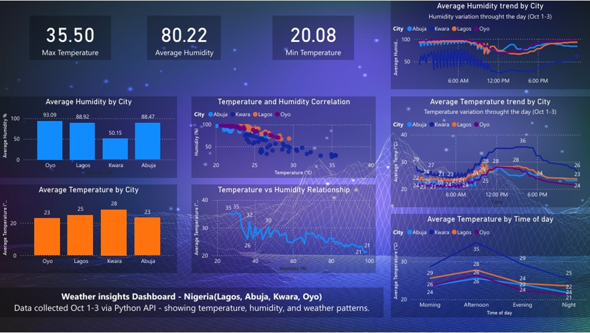

🌦 Weather Data Pipeline

Overview

This project collects live weather data from cities like Lagos, Abuja, Kwara, and Oyo using the OpenWeatherMap API.  
The data updates automatically every 30 minutes using Python, is stored in MySQL, and visualized in Power BI.

Tools Used

- Python (Requests, Schedule, JSON)
- MySQL
- Power BI
- OpenWeatherMap API

ETL Process

Extract: Weather data is fetched from the API.  
Transform: City names, temperature, and humidity are formatted for consistency.  
Load: The cleaned data is inserted into a MySQL database for easy access.

Key Highlights
- Automated a real-time data collection pipeline.  
- Built database structure for storing live data.  
- Connected Power BI via DirectQuery for real-time visualization.

Dashboard Preview

>*Power BI dashboard showing real-time temperature and humidity insights across Nigerian cities*
